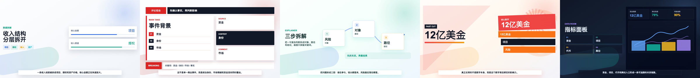

# 视觉风格选择

> Shin-video AI 员工体系中的「视觉顾问」Skill。它不是孤立提示词，而是整条文章转口播视频流水线的一环。

## 它能解决什么问题

视觉风格不能由 Agent 自己默认套。这个 Skill 用一问一答确认用户要的数据感、发布会感、叙事感或技术感，并确认 16:9 / 9:16。

## 它在工作流里的位置

**阶段：** 第 8 步：风格与比例确认

**上游：**
- remotion-video-director

**下游：**
- animation-preset-builder

## 输入什么

- runtime/director-plan.json
- 用户对画面感觉的回答
- 视频比例选择

## 输出什么

- 明确的风格结论
- 视频比例
- 交给 animation-preset-builder 的风格需求

## 背后由哪些能力组成

这个 Skill 自身负责：

- 阻止默认风格
- 让用户参与关键审美决策
- 把中文审美需求翻译成可执行配置方向

它通常由 `shin-video-director` 总控调用，也可以在当前项目材料已经准备好时单独调用。

## 每个 Skill 的作用

在完整 AI 员工体系里，本 Skill 的职责是：**视觉顾问**。

它不负责：

- 不直接生成 MP4
- 不跳过用户确认
- 不自动选择默认风格

## 演示截图 / 视频



演示重点：演示截图展示四种中文+英译风格候选。

完整视频 Demo 建议放在总控仓库或 ThinkAI Skill 页面中展示；单个 Skill 仓库保留截图和阶段说明，避免每个子仓库重复放大视频文件。

## 适合谁买

希望让视频风格可控、可解释、可复用的用户。

## 下载 / 安装方式

```bash
npx skills add https://github.com/Shinchan-crayon/style-consultant
```

安装后，在支持 Skill 的 Agent 中说：

```text
请使用 视觉风格选择，继续处理当前 Shin-video 项目。
```

## 付费版本和定制服务入口

- 免费版：安装本 Skill，按本地 Shin-video 工作流手动配置运行。
- 付费版：可提供整套工作流安装包、环境部署协助、示例项目和远程排障。
- 定制服务：可按行业定制口播风格、导演规则、Remotion 模板、品牌视觉系统和 ThinkAI 上架页面。

咨询入口：ThinkAI Skill 广场 / GitHub Issues / 私信定制咨询

## 验收标准

使用本 Skill 后，至少要能确认：

- 已正确生成或推进到：明确的风格结论
- 已正确生成或推进到：视频比例
- 已正确生成或推进到：交给 animation-preset-builder 的风格需求
- 没有绕过它的上游依赖。
- 没有把本 Skill 明确不负责的事情混进来。
- 出错时能说清楚卡在哪个输入或环境条件上。

## 能力边界

- 不直接生成 MP4
- 不跳过用户确认
- 不自动选择默认风格

Shin-video 追求的是「可维护的本地视频生成工作流」，不是把所有能力塞进一个万能提示词。这个 Skill 只负责自己这一段，完整成片需要配合其它 AI 员工和本地 Shin-video 项目。
